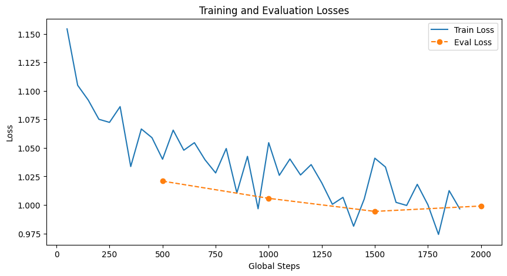
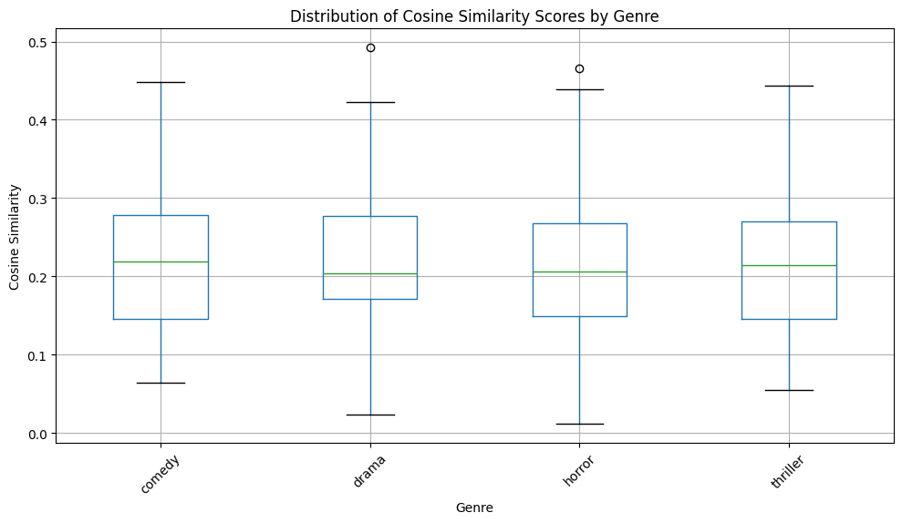
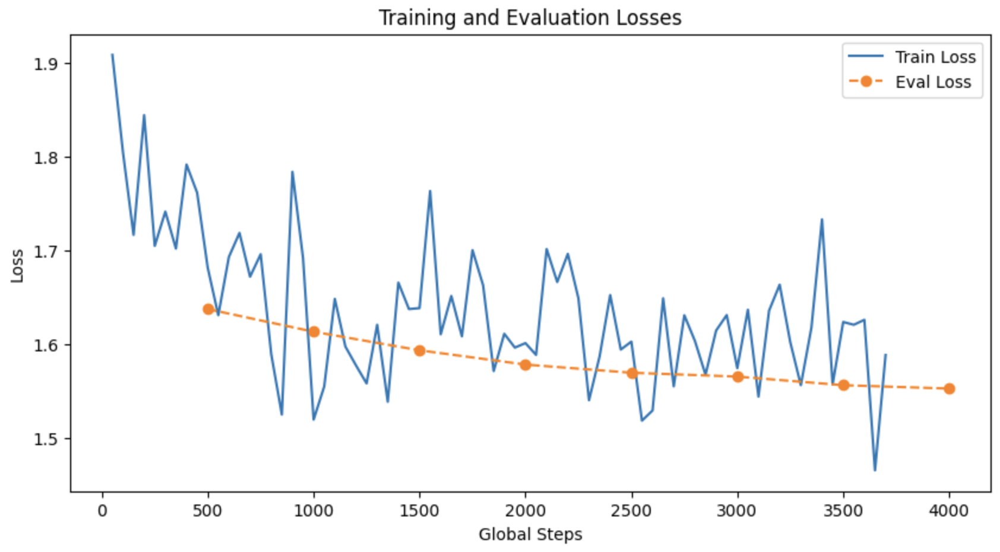
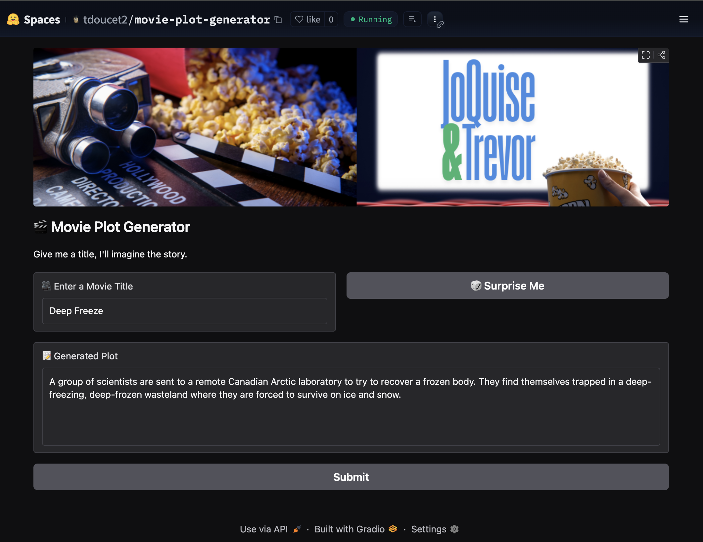

## Abstract

We explore the task of generating movie plot summaries from title prompts using a fine-tuned transformer model. Our approach began with fine-tuning Facebook's BART-Large-CNN on a filtered dataset of approximately 10,000 title-plot pairs, collected from The Movie Database API and a public Kaggle dataset. The data was deduplicated and filtered to include only summaries between 40 and 80 words. Our implementation includes custom preprocessing, early stopping, and evaluation using ROUGE and cosine similarity metrics. We conducted decoding parameter tuning to identify configurations that produced coherent outputs. The resulting system is deployed as a web-based demo that allows users to input a title and generate a corresponding plot summary

## Introduction

Large language models have shown strong performance on a range of generation tasks, particularly when fine-tuned on domain-specific datasets. In this project, we examine whether a summarization-based transformer model can be adapted to generate narrative content when prompted with only a movie title.

We approached this as a supervised learning problem, using a curated dataset of title-plot pairs to train the model. Our goal is to evaluate the effectiveness of fine-tuning in guiding the model to produce short plot summaries that are both readable and relevant to the input title. This work contributes an end-to-end implementation of the generation pipeline, from data preprocessing through evaluation and deployment. 

## Related Work

### 1. AutoAD: Movie Description in Context

One of the standout works, AutoAD, created a generative model that takes in movies and outputs them in text form. They did this by using CLIP, a vision-language model to extract multi-frame features, that is mapped to a transformer encoder into prompt vectors and GPT-2 to generate text conditioned on prior Audio Description (AD) context and subtitles. Their design is able to address the nature of descriptions against dialog, while leveraging some prompt-tuning adapters to fuse visual and textual signals.

In our project, while we focus solely on text inputs, AutoAD’s core idea of conditioning on both past outputs and external context informs our approach. We similarly concatenate previously generated summaries with title‑prompt embeddings before invoking BART‑Large‑CNN, which mirrors their recurrent inference loop for narrative coherence. Although our implementation does not process raw frames or audio, the conceptual layering of context and the emphasis on staged model adaptation guided our trainer setup.

### 2. ScreenWriter: Zero‑Shot Screenplay Generation

Similar to AutoAD, Mahon and Lapata et al. introduce ScreenWriter, which is a framework that ingests raw video and outputs structured screenplays—scene segmentation, speaker roles, dialogue, and visual descriptions—without any script input. Once scenes are detected, ScreenWriter is able to assign character identities by matching diarized face embeddings to an external actor database. For hierarchical summarization, they are able to employ a two‑level transformer: a scene‑level summarizer and a global aggregator.

Although our pipeline ingests only textual data, ScreenWriter’s emphasis on modular segmentation and hierarchical summarization resonates strongly with our design. Their two‑level summarizer inspired our split of a light preprocessing stage followed by the fine‑tuned BART summarizer. 

### 3. Movie Plot Analysis via Turning Point Identification

More aligned with our project, Papalampidi et al. (2019) and the group are able to use Turning Point (TP) Identification as a computational task. They defined five turning points within a plot: Opportunity, Change of Plans, Point of No Return, Major Setback, Climax. They use these definitions across 99 scripts and project these labels onto full screenplays using BiLSTM‑encoded synopsis context, a synopsis encoder for contextualizing word representations. Their neural segmentation model (CAM, TAM) encodes scene and synopsis features with attention mechanisms to classify each scene’s TP label.

We borrow some of their high‑level insight when we considered the summarization and retrieval, as we still wanted to prioritize creativity. While we don’t reproduce their BiLSTM classifier, their conceptual mapping of “where the story turns” fed us inspiration.

### 4. Two-Stage Movie Script Summarization

Even more in relation to our model, Liu and Hong et al. (2022) propose a two‑stage summarization to handle extremely long movie scripts (about 24 K tokens). Stage 1 regex‑parses “action” lines and includes initial dialogues upon character introduction, compressing scripts to about 8 K tokens. Their Stage 2 uses fine tuning on a Longformer‑Encoder‑Decoder (LED) with parameter‑efficient methods (BitFit and NoisyTune) on the compressed inputs, creating a balance between context coverage and compute efficiency.

Although we fine‑tune a BART model rather than LED, the principle of staged reduction plus efficient parameter updates is shared, as it is reflected in our choice of learning rate, early‑stopping, and limited fine‑tuning epochs.

### 5. MovieSum: An Abstractive Summarization Dataset

Lastly, MovieSum is a large‑scale benchmark of 2,200 manually formatted screenplays paired with Wikipedia plot summaries, which was introduced by Saxena & Keller (2024). They preserve screenplay structure via Celtx XML, enabling models to attend to scene headings, character cues, and action lines.

MovieSum’s metadata, such as IMDb IDs, genre labels, and release years, helped guide us in the right direction to define a genre-balanced sample to evaluate our cosine similarity during testing.

## Approach

### Model Selection

We selected Facebook's `bart-large-cnn` model as the base architecture for our task. BART is a transformer-based encoder-decoder model pre-trained for text generation and summarization. It combines the benefits of BERT-style bidirectional encoding with GPT-style autoregressive decoding, making it an ideal choice for tuning structured prompts into narrative-like outputs. 

### Data Processing

We fine-tuned the model using a filtered dataset of approximately 10,000 title-plot pairs. The data was drawn from The Movie Database API and the Wikipedia Movie Plots Kaggle dataset, then deduplicated and filtered to include only summaries between 40 and 80 words.

To prepare the data, we used a custom `preprocess()` function to tokenize the prompt and plot using Hugging Face's `BartTokenizer`. Tokenization was applied with a maximum sequence length of 256, with padding enabled to ensure uniform input length. The dataset was managed using the `datasets` library and split into 80% training, 10% validation, and 10% test sets using `DatasetDict`.

### Training Configuration

We trained the model using Hugging Face's `Trainer` class. Training was configured with a batch size of 4, a learning rate of 2e-5, and a single epoch. Evaluation was performed every 500 steps, with logging every 50 steps. To prevent overfitting, we implemented early stopping with a patience value of one evaluation cycle. The table below shows the training and validation loss across key checkpoints during the single epoch:  

| Step | Training Loss | Validation Loss |
|------|---------------|-----------------|
| 500  | 1.0401        | 1.0209          |
| 1000 | 1.0546        | 1.0058          |
| 1500 | 1.0410        | **0.9944**      |

Validation loss steadily decreased and dropped below training loss by step 1500, suggesting the model generalized well and avoided overfitting.

A custom LogCallback tracked loss metrics in real time, enabling visualization of convergence throughout training. TensorBoard integration was also enabled for real-time monitoring. 

### Evaluation and Output

Final model evaluation was conducted on the test set. We measured loss and computed perplexity as a measure of generation confidence. We computed perplexity using the following equation: 

$$
\text{Perplexity} = \exp(\mathcal{L})
$$

where $\mathcal{L}$ represents the average negative log-likelihood loss. 

Our final model achieved a **perplexity score of 2.71**, indicating that the model was reasonably confident in generating its outputs. 

## Evaluation

We evaluated the model's performance after fine-tuning using both quantitative metrics and qualitative analysis to assess the coherence and relevance of generated plots.

To evaluate generation quality, we conducted two primary experiments: a decoding hyperparameter search using ROUGE-L F1 and a semantic similarity analysis using cosine similarity.

### ROUGE-Based Hyperparameter Search

We randomly sampled 50 validation examples and performed up to 20 trials using a randomized grid of decoding parameters: temperature, top-k, top-p, minimum/maximum length, and no-repeat n-gram size. For each trial, we computed ROUGE-L F1 to assess the overlap between generated and reference summaries. Early stopping was applied if no improvement was observed over five trials. 

The ROUGE-L F1 metric is defined as:

$$
\text{ROUGE-L}_{F1} = \frac{(1 + \beta^2) \cdot \text{Precision} \cdot \text{Recall}}{\text{Recall} + \beta^2 \cdot \text{Precision}}
$$

$$
\text{Precision} = \frac{\text{LCS}(X, Y)}{\text{length of } X}
$$

$$
\text{Recall} = \frac{\text{LCS}(X, Y)}{\text{length of } Y}
$$

$$
\beta = 1
$$

The table below shows the top 5 decoding configurations, sorted by ROUGE-L F1 score: 

| Temp. | Min | Max | Top-k | Top-p | N-Gram | R-L F1 |
|-------|------------|------------|-------|-------|------------|-------------|
| 0.50  | 40         | 80         | 50    | 0.95  | 3          | 0.164267    |
| 0.01  | 40         | 80         | 0     | 0.80  | 2          | 0.156882    |
| 0.80  | 50         | 60         | 0     | 0.80  | 2          | 0.144175    |
| 0.80  | 50         | 60         | 50    | 0.95  | 2          | 0.144095    |
| 0.80  | 40         | 80         | 0     | 0.95  | 3          | 0.138910    |

The results were exported to `random_search_rouge_baseline.xlsx` for reference. The best-performing config (temperature=0.5, min_length=40, max_length=80, top-k=50, top-p=0.95, no-repeat n-gram=3) was used in the downstream evaluations.

### Cosine Similarity Analysis

We applied the best configuration to a genre-balanced sample and evaluated semantic similarity using cosine scores between TF-IDF vectors of the generated and original plots. Cosine similarity is defined as: 

$$
\text{CosineSimilarity} = \frac{\vec{A} \cdot \vec{B}}{||\vec{A}|| \cdot ||\vec{B}||}
$$

Where $\vec{A}$ and $\vec{B}$ are the vectorized representations of the base and generated plots.

Example results revealed a wide range of outcomes. A top match included a well-aligned plot for *The Killers*, whereas a low-similarity case generated a confusing output for the prompt *Jennifer*, which read: 

> *"Jennifer is a young woman who has been trying to find a way to get out of her marriage to her husband's brother..."*

This highlights the model's occasional semantic confusion.

### Qualitative Testing and Stress Behavior

During fine-tuning, we experimented with varying the target summary length. Initially, we allowed up to 200 words, but found that the model generated overly verbose and often incoherent plots. Outputs included repetitive phrasing and fragmented sentence structures. The observation informed our decision to constrain summaries to a 40-80 word range, which resulted in more readable results. 

### Observations on Bias and Behavior

Genre bias was not deeply explored, but tests indicated that horror, action, and drama tended to yield more relevant outputs compared to niche genres like romance or musical. These genres were better represented in the dataset, with over 1,000 entries each, while niche genres appeared far less frequently. The imbalance in genre distribution likely influenced model performance and is worth further investigation. 

## What We Learned

Throughout this project, we gained a deeper understanding of the model development lifecycle, from model selection to deployment. We learned how to identify an appropriate architecture for a given task - in this case, using BART for controlled text generation. Along the way, we also recognized the practical tradeoffs between using GPUs and CPUs, especially when tuning hyperparameters or evaluating multiple configurations. 

Another key takeaway was the importance of high-quality, clean data. Part of the reason we selected this task was to avoid extensive data cleaning and focus instead on modeling and evaluation.

For future improvements, we're interested in exploring longer-form generation tasks and adapting the system to maintain continuity across sequels-such as generating plots for movie series with existing characters or storylines. 

## Demo Interface

## References

Han, T., Bain, M., Nagrani, A., Varol, G., Xie, W., & Zisserman, A. (2023). *AutoAD: Movie description in context* [Preprint]. arXiv. [https://arxiv.org/abs/2303.16899](https://arxiv.org/abs/2303.16899)

Liu, D., Hong, X., Lin, P.-J., Chang, E., & Demberg, V. (2022, October). Two-stage movie script summarization: An efficient method for low-resource long document summarization. In K. McKeown (Ed.), *Proceedings of the Workshop on Automatic Summarization for Creative Writing* (pp. 57–66). Association for Computational Linguistics. [https://aclanthology.org/2022.creativesumm-1.9/](https://aclanthology.org/2022.creativesumm-1.9/)

Mahon, L., & Lapata, M. (2024). *ScreenWriter: Automatic screenplay generation and movie summarisation* [Preprint]. arXiv. [https://doi.org/10.48550/arXiv.2410.19809](https://doi.org/10.48550/arXiv.2410.19809)

Papalampidi, P., Keller, F., & Lapata, M. (2019). *Movie plot analysis via turning point identification* [Preprint]. arXiv. [https://arxiv.org/abs/1908.10328](https://arxiv.org/abs/1908.10328)

Saxena, R., & Keller, F. (2024). *MovieSum: An abstractive summarization dataset for movie screenplays* [Preprint]. arXiv. [https://arxiv.org/abs/2408.06281](https://arxiv.org/abs/2408.06281)